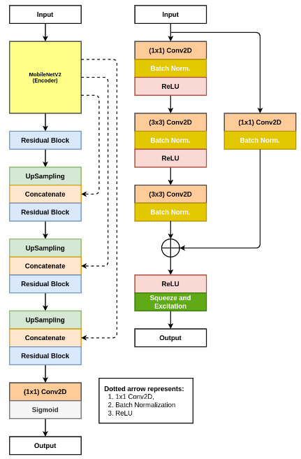
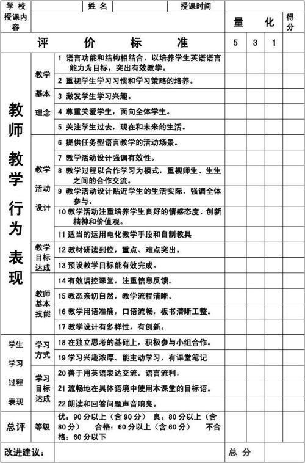
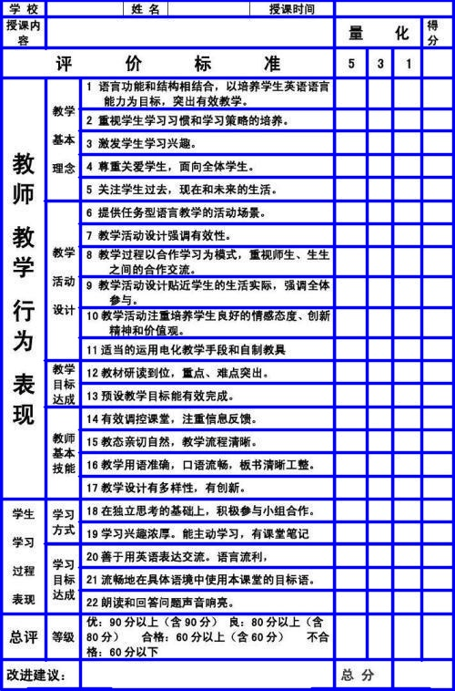
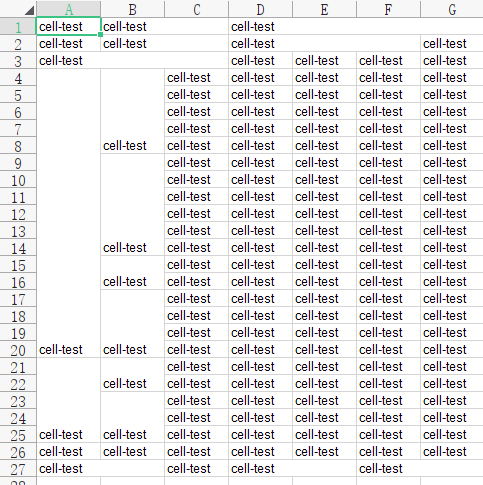
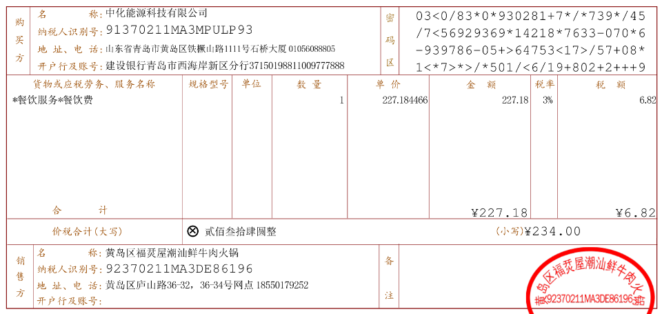
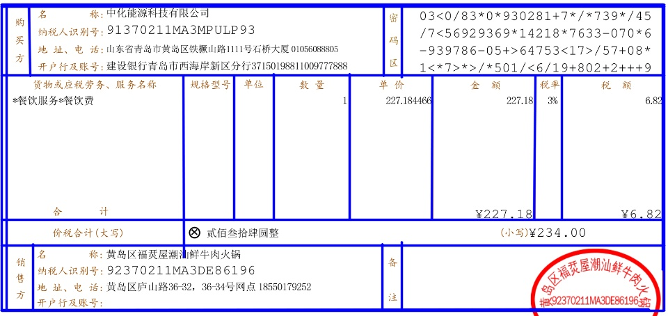
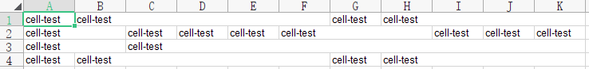

[简体中文](README_CN.md) | English

# NanoNet-Table: An Ultra-Lightweight Method for Wired Table Recognition

I accidentally came across a paper from CBMS 2021 titled *NanoNet: Real-Time Polyp Segmentation in Video Capsule Endoscopy and Colonoscopy*.

This paper proposes an architecture specifically designed for polyp segmentation in video capsule endoscopy and colonoscopy images, serving as a medical image segmentation method.

Inspired by this model architecture, I intend to develop an ultra-lightweight wired table recognition method. The trained model is approximately __1MB__ in size (isn’t that extremely lightweight?), making it effortless to deploy on mobile devices manually.

The training dataset consists of around 1000 images annotated by myself. For better performance, the dataset size can be increased. The model is trained using TensorFlow.

To ensure users can utilize the method freely and effortlessly, I have converted the TensorFlow-trained model to the ONNX format. Only ONNX Runtime is required for recognition and inference.



## Implemented Features

Recognize lines in tables

Convert results to Excel format

## Weight Model Files

Model files:

1. models/model.h5

2. models/table\_light\_line.onnx

## Training (Trained with TensorFlow 2.5)

Refer to `train/``train.py` in this project.

## ONNX Inference

Refer to `onnx_infer/``onnx_inference.py` in this project.

```python
from onnx_infer.table_build import table_xlsx
from onnx_infer.table_line import load_table_wire_line_model, table_line
from onnx_infer.table_structure_reg import table_ceil
from onnx_infer.utils import draw_lines

table_wire_model_path = '../models/table_light_line.onnx'

# load model
table_wire_model = load_table_wire_line_model(table_wire_model_path)

import cv2

table_img = '../test_imgs/6.jpg'

table_img = cv2.imread(table_img)

# get rows and columns
rowboxes, colboxes = table_line(table_wire_model, table_img)

# draw lines
img = draw_lines(table_img, rowboxes + colboxes, color=(255, 0, 0), lineW=2)
cv2.imwrite('../test_imgs/6_line.jpg', img)

# get ceil boxes
ceilboxes = table_ceil(table_img, rowboxes, colboxes)

print(ceilboxes)

# convert to an excel table
workbook = table_xlsx(ceilboxes)
workbook.save('table_ceil.xlsx')
```

## Partial Recognition Result Demonstration

In the converted Excel structure, the text "cell-test" in each cell of the table is manually added. Later, OCR can be integrated to fill the actual text into the cells.







***







## Contact
1. github：https://jiangnanboy.github.io
2. blog：https://blog.csdn.net/qq_20182781
3. email:2229029156@qq.com
   
